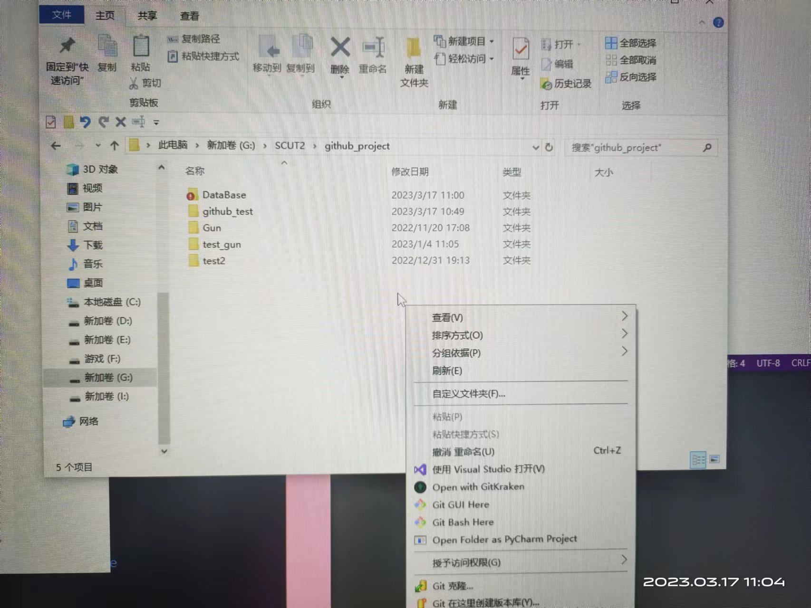
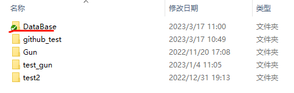
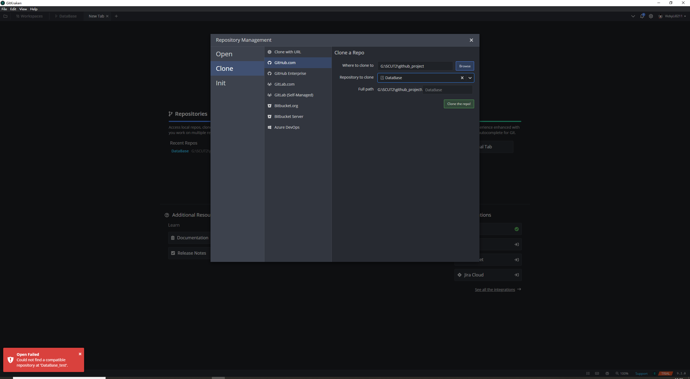
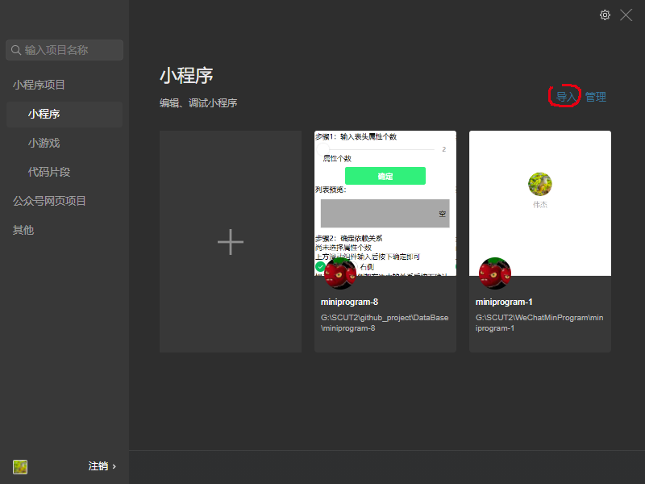
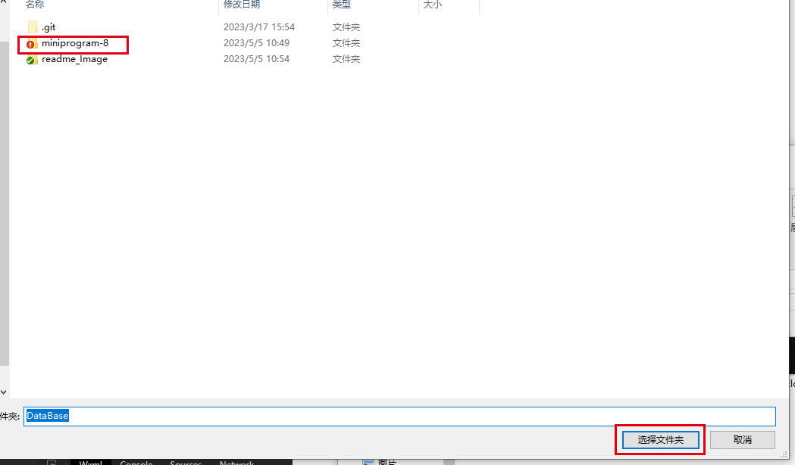

# DataBase
Project Design of DataBase
___
## 下载仓库

### 1.命令行
在目标文件夹下，右键，选择'Git Bash Here'



输入   ```git clone https://github.com/Viki1314/DataBase.git```

如图二所示，DataBase文件夹图标出现“绿勾”,即github管理该文件



接下来，可以用 GitKraken 打开该本地仓库 

or 直接用命令行管理
```
git add <filename> or git add .
git commit -m 'message'
git push

git pull
```

### 2.GitKraken



———————————————————————————————————

## 微信开发者工具导入项目




———————————————————————————————————
## 算法文件algorithm.js

## 3NF部分的js算法文件ThreeNF.js
2023.05.16已导入（v1.0）  
该文件上半部分为preparation，下半部分为3NF的算法实现。  
